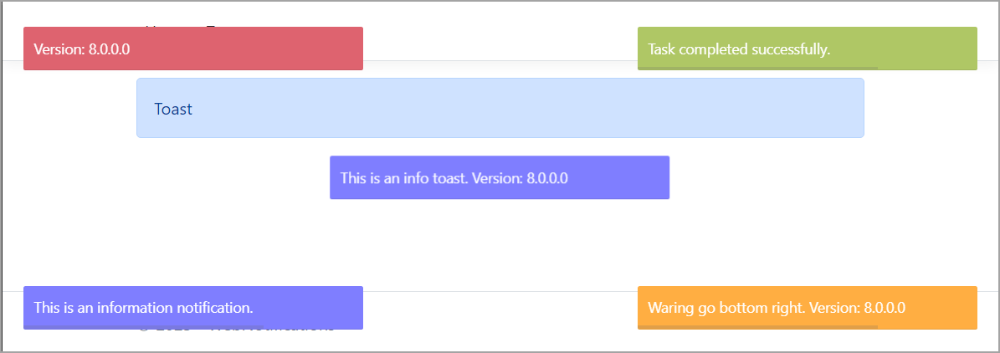

# About

Easy to create toast notifications using [Asp.Net Core abstraction](https://github.com/nabinked/NToastNotify/tree/master)



NuGet packages

- AspNetCoreHero.ToastNotification
- NToastNotify

Configuration

**Program.cs**

```csharp
public class Program
{
    public static void Main(string[] args)
    {
        var builder = WebApplication.CreateBuilder(args);

        // Add services to the container.
        builder.Services.AddRazorPages().AddNToastNotifyNoty(new NotyOptions
        {
            ProgressBar = true,
            Timeout = 5000
        });

        builder.Services.AddNotyf(config =>
        {
            config.DurationInSeconds = 5;
            config.IsDismissable = true;
            config.Position = NotyfPosition.BottomRight;
        });
```

And

```csharp
        app.UseNToastNotify();

        app.UseNotyf();

        app.MapRazorPages();

        app.Run();
    }
}
```

**_Layout.cshtml**

:stop_sign: Very important to get the two **InvokeAsync** as shown
```csharp
    <script src="~/js/site.js" asp-append-version="true"></script>

    @await RenderSectionAsync("Scripts", required: false)
    @await Component.InvokeAsync("NToastNotify")
    @await Component.InvokeAsync("Notyf")
</body>
</html>
```

## Javascript toast

**toastr** is a Javascript library for non-blocking notifications. jQuery is required. The goal is to create a simple core library that can be customized and extended.

- [toastr](https://codeseven.github.io/toastr/)
- [toastr builder](https://codeseven.github.io/toastr/demo.html)
- [GitHub](https://github.com/CodeSeven/toastr)

From ToastPage.cshtml

```javascript
toastr.options = {
    "closeButton": true,
    "debug": false,
    "newestOnTop": false,
    "progressBar": true,
    "positionClass": "toast-top-full-width",
    "preventDuplicates": false,
    "showDuration": "300",
    "hideDuration": "1000",
    "timeOut": "2000",
    "extendedTimeOut": "1000",
    "showEasing": "swing",
    "hideEasing": "linear",
    "showMethod": "fadeIn",
    "hideMethod": "fadeOut"
}

toastr["info"]("Welcome aboard");
```
